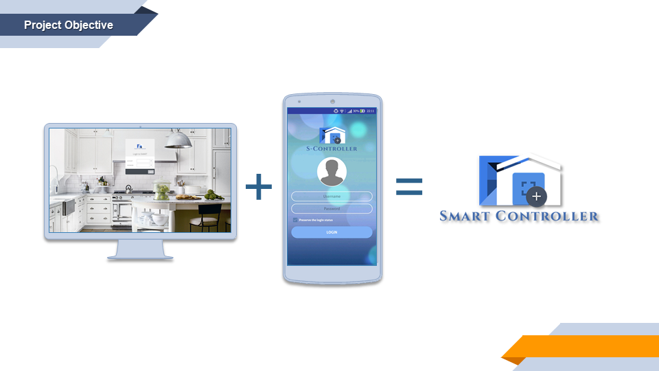
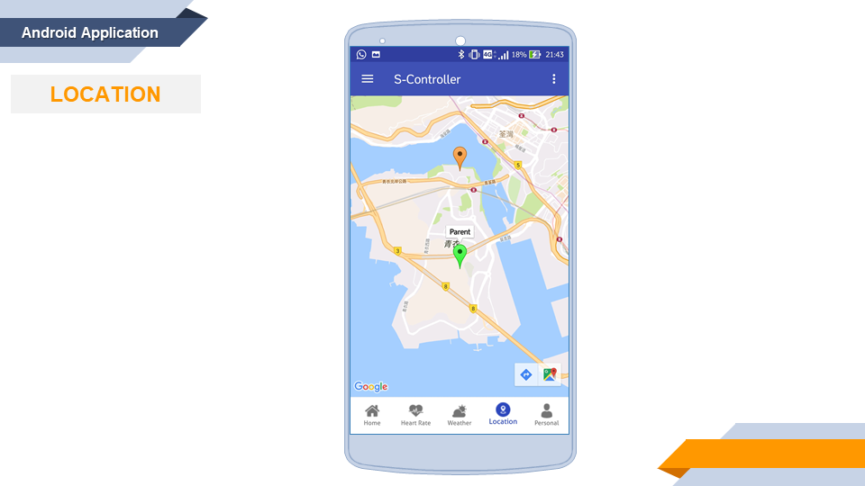
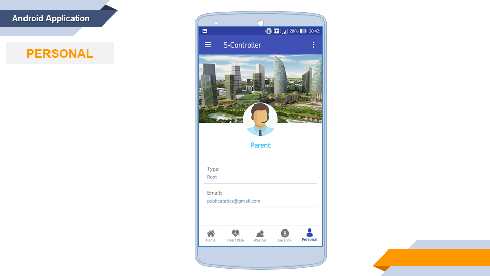

#  SmartController

> IVE 2015/16 Final Year Project

> Android Application with CMS website (Content Management System): Digital Home System in IoT Environment with Sensor Control Model Building (Using Raspberry Pi 3 and different Arduino sensors)

[](https://travis-ci.org/alvinau0427/SmartController)
[](LICENSE)

## Getting Started
- The project aims to build a digital home system with multiple platforms for focusing on the element of “safety” and targeting on the user of “family” for preventing the occurrence of accidents. Regarding the system, there are two platforms -Android application and Website. The system can automate the processes, make some records and perform all operations related to the users, which can provide the direct status of the working environment and the direct information of the users. In order to avoid the emergence of these home accidents, the digital home system will be applied. There are some sample features in the system such as avoiding children climb out of the house, preventing the children getting dangerous items (E.g. weapon, flammable liquids) and notifying the parents if a disaster is happened etc.

## Features
##### Sensors
- Partial area (Living room)
	- Close thhe windows automatically when it rains
	- Detect temperature and humidity of home location
	- Check the heart rate
	- Turn on / off the light automatically
- Partial area (Kitchen)
	- Turn off the electric range via mobile appllcation
	- Turn on / off the drawer lock automatically
- Partial area (Bathroom)
	- Open the exhaust fan automatically if the carbon monoxide is detected

##### Android Application
- Home page
	- Display the actuators for control with push notification and the weather information
	- Voice control
- Heart rate page
	- Measuring heart rate
	- Check history record
- Weather page
	- Display weather information
- Location page
	- Get other user's location by map interface (for root user only)
- Personal page
	- Display personal information
- Settings page
	- Handle the preference settings
	
##### Website CMS
- Display the actuators for control with notification and the weather information
- Manage the actuators
- Manage notification records
- Get other user's location by map interface (for root user only)
- Set function policy
- Display personal information

## Installation

### Setup
##### Server Setup
- Get dynamic DNS
	- P.S. If you have your server, you can ignore the step and use your server for other settings directly.
	- Go to the link https://www.noip.com/ and create an account.
	- In the `Dashboard` page, enter a hosyname you want in the tab `Quick Add` and click `Add Hostname`.
	- Unfer the tab `Dynamic DNS - Device Configuration Assistant`, select the above host nameand follow your router settings to finish the steps.
	- Go to the link https://www.noip.com/download?page=win and download the Dynamic DNS Update Client.
	- After sign in with your account, choose your host created in step 2 and save it.
	- Click `Refresh Now`.
	- Open XAMPP and start Apach and MySQL.

- Import of database
	- Open your server database in the link http://127.0.0.1:8080/phpmyadmin
	- Import the sql file called iot.sql in `src/database/`

- Installation of pthreads
1. Judging PHP is ts or nts version
	- Through phpinfo(); to see the one of the "Thread Safety" item. If "enabled", in general should be ts version. Otherwise, it it the nts version.

2. Choosing a relevant version
	- Download path: http://windows.php.net/downloads/pecl/releases/pthreads/2.0.9/

3. Installing pthreads extension
	- Unzip the file and get the pthreadVC2.dll and php_pthreads.dll. Put the former one to the `X:/xampp/php/`, and the later one to the `X:/xampp/php/ext/`
	- Edit the php.ini, add `extension=php_pthreads.dll` under the tab `Dynamic Extension`.
	- Restart the Apache server and turn on

- Reference
	- https://www.youtube.com/watch?v=kcBXy3arTko
	- https://my.oschina.net/yanhx/blog/198114

##### Android application setup
- Change server path
	- Open the project via Android Studio
	- In the `MainActivity`, change the path or Dynamic DNS path.

##### Website CMS setup
- Change server path
	- Open the file in `src/web/FYP/config.php`
	- Change the value of `URLROOT` to your server path or Dynamic DNS path.
	- After the above settings you have to run a `FYP/weather.bat` for each opening server for updating the weather records. And you can also write a logon script to perform the action.

## Screenshots
| Project Objective     |
| :-------------: |
|  |

| Home Page     |
| :-------------: |
|  |

| Heart Rate     |
| :-------------: |
|  |

| Weather     |
| :-------------: |
|  |

| Location     |
| :-------------: |
|  |

| Personal Page     |
| :-------------: |
|  |

| CMS Website     |
| :-------------: |
|  |

## Demonstration
- For more information of the project demonstration, please click [here](https://youtu.be/rLazYdiA1WA) to watch the following video.
[](https://youtu.be/rLazYdiA1WA)

## License
- SmartController is released under the [Apache Version 2.0 License](http://www.apache.org/licenses/LICENSE-2.0.html).
```
Copyright 2016 alvinau0427

Licensed under the Apache License, Version 2.0 (the "License");
you may not use this file except in compliance with the License.
You may obtain a copy of the License at

   http://www.apache.org/licenses/LICENSE-2.0

Unless required by applicable law or agreed to in writing, software
distributed under the License is distributed on an "AS IS" BASIS,
WITHOUT WARRANTIES OR CONDITIONS OF ANY KIND, either express or implied.
See the License for the specific language governing permissions and
limitations under the License.
