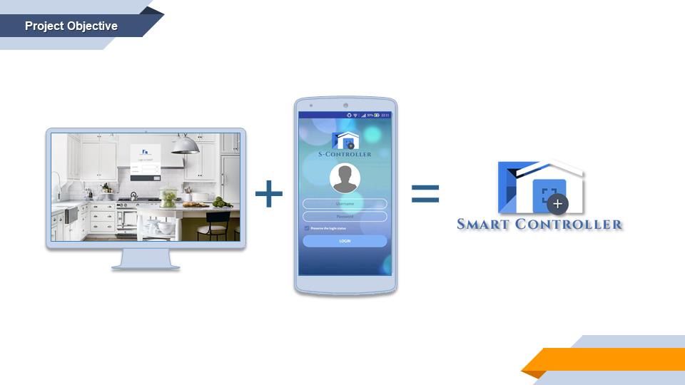
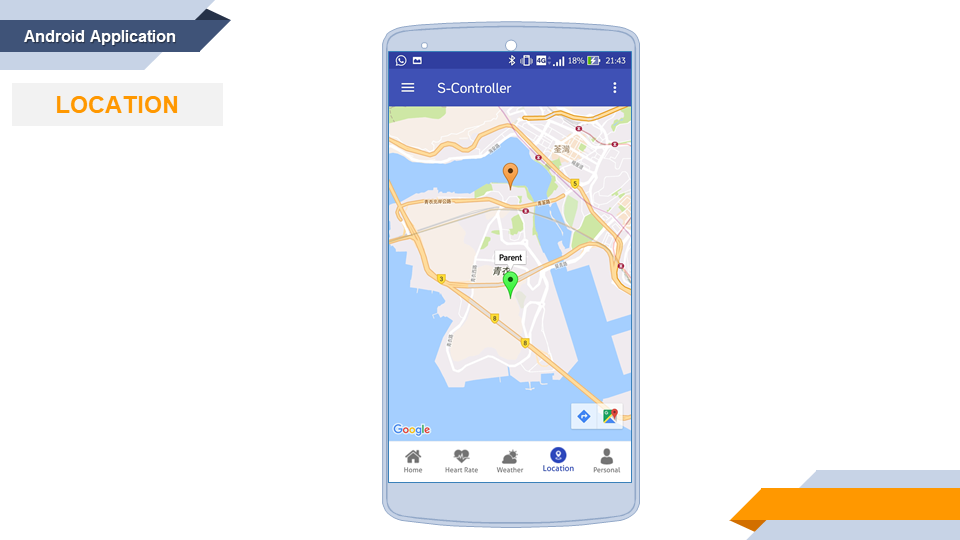
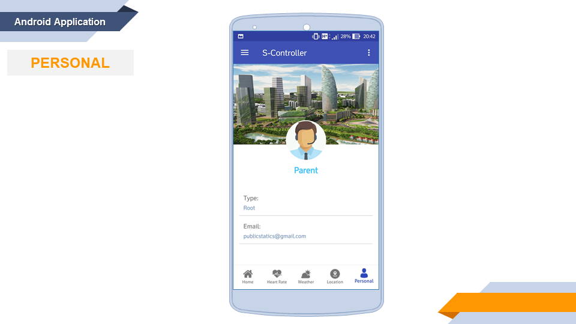

#  SmartController

> **IVE 2015/16 Final Year Project**
> 
> **IoT-Based Digital Home Ecosystem:** A multi-platform home automation and safety system integrating Android, Web CMS, Raspberry Pi 3, and Arduino sensor networks.

[](#) &nbsp;
[](#) &nbsp;
[](#) &nbsp;
[](#) &nbsp;
[](#) &nbsp;
[](#) &nbsp;
[](LICENSE) &nbsp;

## Project Overview
**SmartController** is an integrated Digital Home System designed with a core focus on **family safety** and **accident prevention**. By leveraging IoT sensor models, the system automates environmental responses to protect vulnerable family members (children and elderly) from potential home hazards.

### Core Mission
* **Automation:** Real-time response to environmental changes (Rain, Gas, Temperature).
* **Safety Monitoring:** Specialized sensors to prevent children from climbing windows or accessing dangerous items.
* **Health Tracking:** Integrated biometric monitoring for family members.
* **Remote Control:** Seamless management of home appliances via mobile and web interfaces.

## Key Features
### IoT Sensor Network (Hardware Layer)
* **Living Room Module:** * Smart Windows: Automatically closes upon rain detection.
    * Climate Control: Real-time Temp/Humidity monitoring and automated lighting.
    * Biometrics: Integrated heart rate sensor for health tracking.
* **Kitchen Module:** * Appliance Safety: Remote cut-off for electric ranges.
    * Smart Storage: Automated drawer locks for hazardous items (knives/chemicals).
* **Bathroom Module:** * Air Quality: Automated exhaust fan activation upon Carbon Monoxide (CO) detection.

### Android Application
* **Dashboard:** Real-time actuator status, push notifications, and local weather.
* **Voice Control:** Hands-free command interface for smart home operations.
* **Geolocation:** Map-based tracking of family members (Admin/Root only).
* **Health History:** Chronological logging of heart rate measurements.

### Web CMS (Administrative End)
* **Actuator Management:** Granular control over all hardware components.
* **Policy Configuration:** Define automated rules and sensor trigger conditions.
* **Audit Logs:** Complete history of notification records and system alerts.

## Installation & Environment Setup
### 1. Server Configuration (XAMPP & Dynamic DNS)
1. **Dynamic DNS:** Register a hostname at [No-IP](https://www.noip.com/) and configure your router/Update Client to map your local IP.
2. **Database:** Import `src/database/iot.sql` via phpMyAdmin (`http://localhost/phpmyadmin`).
3. **PHP Pthreads Extension (Required for Multi-threading):**
    * Determine if your PHP is **TS (Thread Safe)** via `phpinfo()`.
    * Download matching version from [PECL releases](http://windows.php.net/downloads/pecl/releases/pthreads/2.0.9/).
    * Move `pthreadVC2.dll` to `X:/xampp/php/` and `php_pthreads.dll` to `X:/xampp/php/ext/`.
    * Add `extension=php_pthreads.dll` to your `php.ini` and restart Apache.

### 2. Client Setup
* **Android:** Open the project in Android Studio. In `MainActivity`, update the server URL to your No-IP Dynamic DNS path.
* **Web CMS:** Update `URLROOT` in `src/web/FYP/config.php`. 
* **Note:** Ensure `FYP/weather.bat` is running to maintain updated weather data.

## Screenshots
| Project Objective     |
| :-------------: |
|  |

| Home Page     |
| :-------------: |
|  |

| Heart Rate     |
| :-------------: |
|  |

| Weather     |
| :-------------: |
|  |

| Location     |
| :-------------: |
|  |

| Personal Page     |
| :-------------: |
|  |

| CMS Website     |
| :-------------: |
|  |

## Demonstration
- For more information of the project demonstration, please click [here](https://youtu.be/rLazYdiA1WA) to watch the following video.

[](https://youtu.be/rLazYdiA1WA)

## License
- SmartController is released under the [Apache Version 2.0 License](http://www.apache.org/licenses/LICENSE-2.0.html).
```
Copyright 2016 alvinau0427

Licensed under the Apache License, Version 2.0 (the "License");
you may not use this file except in compliance with the License.
You may obtain a copy of the License at

   http://www.apache.org/licenses/LICENSE-2.0

Unless required by applicable law or agreed to in writing, software
distributed under the License is distributed on an "AS IS" BASIS,
WITHOUT WARRANTIES OR CONDITIONS OF ANY KIND, either express or implied.
See the License for the specific language governing permissions and
limitations under the License.
